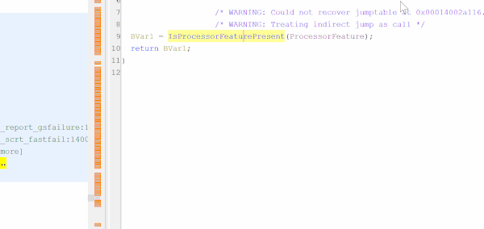
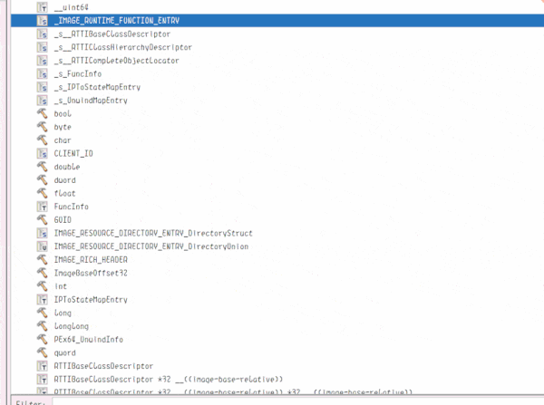
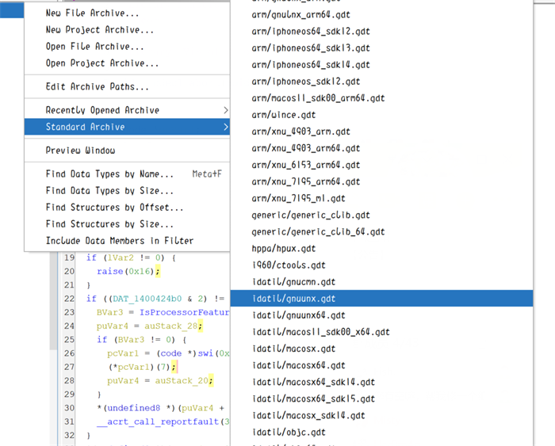

# GhidraIDA

Ghidra's IDA like experience by [@NyaMisty](https://github.com/NyaMisty)

## How to Use (TL;DR)

### Preparation
This configuration MUST be used together with my fork **GhidraMod** : https://github.com/NyaMisty/ghidra_mod

- You can download the build here: https://github.com/NyaMisty/ghidra_mod-ci/releases
- Or Using My Scoop Bucket and Install `ghidramod`: https://github.com/NyaMisty/scoop_bucket_misty

### Onboarding

- In Ghidra's Project Tool, Go to Tools -> Import Tool..., select `mistyCodeBrowser.tool`
- Remove or rename the old `CodeBrowser` by right click
- Rename the new `CodeBrowser_1` to `CodeBrowser`, so that it would be the default CodeBrwoser tool

### Updating

- As you may customize the tool yourself, you can optionally update the KeyBinding instead of updating the whole tool

### See Also

- Import IDA's type into Ghidra: [ImportIDATypes](https://github.com/NyaMisty/GhidraIDA/tree/master/ImportIDATypes)
- (Already Bundled in GhidraMod) Ghidra GDT generated from IDA tils: https://github.com/NyaMisty/ghidra_ida_til

## What's Included?

- **Better UI: Resembles IDA as much as possible**
    - **Specially tuned KeyBinding! (See below for more detail)**
    - **Modal XRef Dialog (Exactly the same as IDA one)**
        
    - **Use Esc Key to Exit Popup Windows**
        

- **More GDT Type Library**
    
    - GDT Type Library generated from IDA Type Library
    - GDT Type Collected from other repositories

- **Various Ghidra<-->IDA Helpers**
    - Including [ImportIDATypes](https://github.com/NyaMisty/GhidraIDA/tree/master/ImportIDATypes)

## KeyBinding Modding

- Improved KeyBindings Managing
    - Allow customizing Shared Keybinding independently (e.g. Specify different action for key X for different view)
    - Remap Meta & Ctrl (Double way, Meta <--> Ctrl)
- Improved Action Trigger (Reducing `Multiple Key Dialog` caused by conflicting Key Binding)
    - Specially Tuned `X` Action: `Find References To Symbol` in Decompiler, `Find References To...` in others
    - Improved `EditLabel` enable context (no longer triggers everywhere, only on label)
    - Improved `Edit Function Signature` enable context (no longer triggers everywhere)
    - Improved `Convert to Decimal/Hex` enable context (only triggers when it's not already this type)

## KeyBindings
- View Operation & Misc:
    - Shift-Fn (Open Views)
    - Alt-F3 (Close View)
    - F6 (Switch Component (view/widget in IDA))
    - Ctrl-W (Save File)
- Data: 
    - U (undefine), C (code)
    - D (define char/word/...), * (Create Array)
    - R (Char), H (Switch Hex/Dec), O (Pointer), Q (Qword)
    - A (String)
    - M (Enum (Equate in Ghidra))
    - Shift-E (Export)
- Common Ops:
    - Y (Edit Type), X (Xref)
    - N (Rename), / (Comment)
- Funcs:
    - F5 (Decompile)
    - P (MakeFunc)
    - Ctrl-K (Edit Stack)
- Navigation:
    - G (Goto) 
    - Esc (Go Back), Ctrl-Enter (Go Next)
    - Alt-B (Search binary), Alt-T (Search Text)

## Credits

- [@NyaMisty](https://github.com/NyaMisty) :
    - https://github.com/NyaMisty/ghidraKb
    - https://github.com/NyaMisty/ghidra_ida_til
    - https://github.com/NyaMisty/ghidra_mod
    - https://github.com/NyaMisty/ghidra_mod-ci
    - https://github.com/NyaMisty/idatil2c
    - https://github.com/NyaMisty/ghidra-data

- Other Keybinding Authors:
    - [@nullteilerfrei](https://github.com/nullteilerfrei) : https://raw.githubusercontent.com/nullteilerfrei/reversing-class/master/ghIDA.kbxml (20210721)
    - [@katechondic](https://github.com/katechondic) : https://raw.githubusercontent.com/katechondic/Ghidra-Win-Keybinds/main/keybindings_windows.kbxml (20221121)
    - [@enovella](https://github.com/enovella) : https://raw.githubusercontent.com/enovella/ida2ghidra-kb/master/keybindings.kbxml (20190408)
    - [@JeremyBlackthorne](https://github.com/JeremyBlackthorne) : https://raw.githubusercontent.com/JeremyBlackthorne/Ghidra-Keybindings/master/Partial%20IDA%20Pro%20Keybindings.csv.kbxml (20190416)

- Other GDT Type Library Authors:
    - [@0x6d696368](https://github.com/0x6d696368) [@egore](https://github.com/egore) : https://github.com/egore/ghidra-data
    - [@kohnakagawa](https://github.com/kohnakagawa) : https://github.com/kohnakagawa/gdt_archive
    - [@knifeyspoony](https://github.com/knifeyspoony) : https://github.com/knifeyspoony/ghidra-data
    - [@AllsafeCyberSecurity](https://github.com/AllsafeCyberSecurity) : https://github.com/AllsafeCyberSecurity/Ghidra_Data_Type
